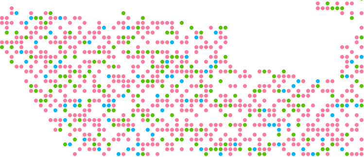

# Algorithms for Geographical Data

## Visualization

#### How to install
1. Install [yarn](https://yarnpkg.com/en/) (package manager)
2. Run `yarn` in the project directory to install dependencies (also needs to be run when dependencies are updated) 

#### How to use
1. Run `yarn start` in the project directory to start a development server on http://localhost:8080
2. Place JSON files in the `data/` directory. They will be automatically picked up by the server.

## Algorithms

Our algorithms are implemented in Java and are placed in the `java/` directory. 
